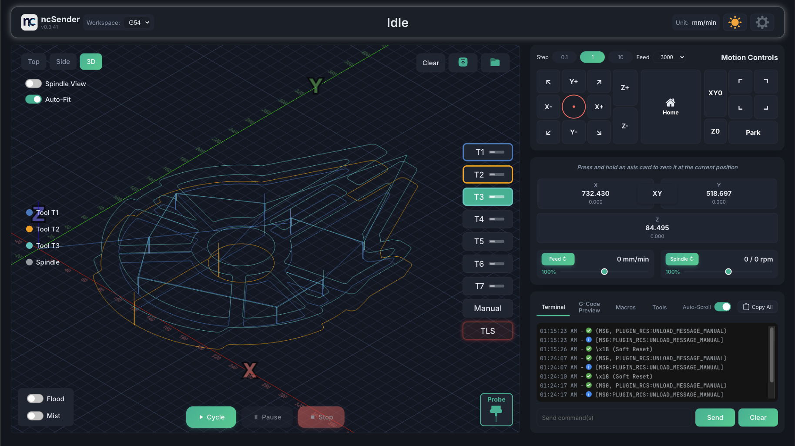
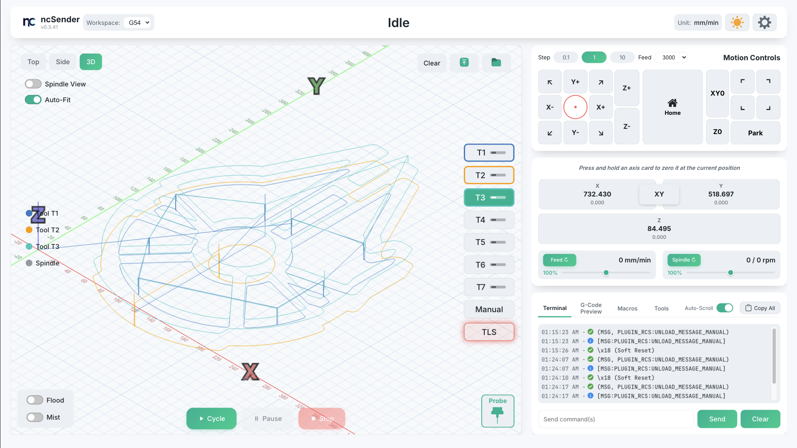
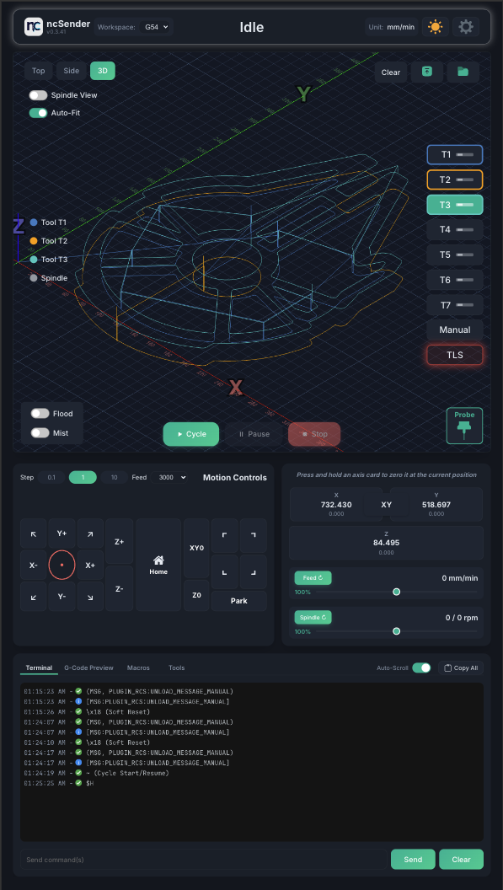

> **IMPORTANT DISCLAIMER:** This is my personal project and has only been tested by me on my AltMill CNC. If you choose to run it, you do so entirely at your own risk. I am not responsible for any damage, malfunction, or personal injury that may result from the use or misuse of ncSender. Use it with caution and at your own discretion.

## 💖 Support My Work

If you enjoy **ncSender** and my other CNC / maker projects, consider supporting me!
Your support helps keep the development going — and also funds my growing addiction to using AI tools for coding. 😆
Apparently, the more I build features, the more tokens I burn. Send help (or coffee). ☕️

[](https://github.com/sponsors/siganberg)
[](https://www.patreon.com/c/FrancisCreation)
[](https://www.paypal.com/donate/?business=JK9NA7HLPQE7N&no_recurring=0&item_name=To+fund+the+development+of+ncSender&currency_code=USD)


# ncSender — Simple, Fast G‑Code Sender for GrblHAL

ncSender is a lightweight, cross‑platform CNC controller with a clean UI and built‑in 3D toolpath preview. It connects to GrblHAL controllers over USB serial or Ethernet and can run either as a desktop app (Electron) or as a small local server you access from any browser on your network.

## 📸 Screenshots

### Dark Mode


### Light Mode


### Portrait Mode


## ✨ Why ncSender
- Cross‑platform desktop app (macOS, Windows, Linux, Raspberry Pi).
- USB serial and Ethernet (telnet‑style) connectivity.
- Live console with command history and real‑time GrblHAL controls (hold, resume, soft reset).
- 3D toolpath preview with progress tracking.
- Workspace selection (G54–G59) and homing prompts.
- Metric and imperial units support with automatic conversion.
- Firmware settings browser for GrblHAL (read/submit, import/export).
- Safe job controls: pause before stop, resume.
- Dead-man switch safety feature for jogging operations.
- Headless mode: run just the server and use it from a browser.
- UI theme support (light/dark) and configurable accent/gradient colors.

## ⚠️ Current Limitations

- **Limit Switches Required**: Machines without physical limit switches are not yet supported, as some functionality relies on machine coordinate movement.
- **GRBL Compatibility**: Although ncSender may work with GRBL, it has not been thoroughly tested. Use with caution.
- **Hardware Tested**: ncSender has only been tested with the Sienci SLEB-EXT board (included with AltMill CNC) running grblHAL or sienciHAL firmware.

## 📦 Install

Download a release from the [Releases page](https://github.com/siganberg/ncSender/releases) for your OS:

- **macOS**: open the `.dmg`, drag ncSender to Applications. Since the app is not code-signed by Apple, you'll need to clear the quarantine attribute before running:
  ```bash
  xattr -c /Applications/ncSender.app
  ```
  Open Terminal (Applications → Utilities → Terminal), paste the command above, and press Enter. After that, you can open ncSender normally.
- **Windows**: run the `.exe` and follow the prompts (you may see a SmartScreen warning for an unsigned app).
- **Linux**: use the `.AppImage` or `.deb` (depending on your distro). Mark the AppImage as executable.
- **Raspberry Pi**: use the ARM64 `.deb` or `.AppImage` package.

## 🎥 Video Guide Playlist

Check out the full video guide on YouTube:

[](https://www.youtube.com/watch?v=FKzFe8b-NkY&list=PL7x16nytZHiPXI6EPsmamY8EM6uo82eLs)

📺 [Watch the full playlist here »](https://www.youtube.com/playlist?list=PL7x16nytZHiPXI6EPsmamY8EM6uo82eLs)

## 🚀 Quick Start
1) Connect your controller
- USB: plug your controller via USB. Default baud is 115200.
- Ethernet: ensure you know the controller's IP and port (default GrblHAL telnet‑style ports are often 23 or device‑specific).

2) Launch ncSender
- On first launch, a setup dialog guides you to choose USB or Ethernet, pick the port, and confirm baud/IP/port. Save to connect.

3) Load a G‑code file
- Use the Visualizer panel to upload or load a file. You’ll see a 3D preview, line count, and file name.

4) Prepare the machine
- Home (if required), set work offsets, and verify workspace (G54–G59) from the toolbar.

5) Run the job
- Click Run. The status shows Running with progress tracking. Use Pause/Resume as needed. Stop safely pauses briefly before soft‑reset to reduce marks.

Theme and colors
- Toggle light/dark from the toolbar sun icon.
- Change accent/gradient colors under Settings → Application Settings.

## 🖥️ Using Headless Mode (advanced)
Run the embedded server without the Electron window and access ncSender from any browser on your network.

- **macOS**: `/Applications/ncSender.app/Contents/MacOS/ncSender --headless`
- **Windows**: `"C:\\Program Files\\ncSender\\ncSender.exe" --headless`
- **Linux/Raspberry Pi (AppImage)**: `./ncSender-*.AppImage --headless` or `ncSender --headless` if installed in PATH

Then open `http://<this-computer-ip>:8090` in a browser (replace with your machine's LAN IP). The port is configurable in Settings (Remote Control Port) and requires an app restart to take effect.

## 💾 Data & Settings
ncSender stores its data per‑platform:
- **macOS**: `~/Library/Application Support/ncSender/`
- **Windows**: `%APPDATA%/ncSender/`
- **Linux / Raspberry Pi**: `~/.config/ncSender/`

These folders are created automatically and contain G‑code files and settings. Files persist across updates and are easy to back up.

## 🔧 Tips & Troubleshooting
- Can't find the USB port
  - Unplug/replug the device and reopen Settings. On Windows you may need the correct USB‑serial driver. On macOS, avoid Bluetooth ports.
- Connection fails
  - Confirm baud rate (115200 is common). For Ethernet, confirm the IP/port and network reachability (firewall). Try power‑cycling the controller.
- "Homing Required"
  - Home the machine first (per your controller/firmware) to clear the prompt.
- Alarm/Locked
  - Use "Unlock" or send `$X` from the console if you understand the risks. Review the last alarm code for details.
- Nothing moves when sending a job
  - Ensure the machine is Idle (not Alarm/Hold), correct workspace selected, and your file units/modes match the machine (G20/G21, G90/G91, etc.).
- Machine behaving unexpectedly
  - Try a soft reset by clicking the center button in the jog controls or send `Ctrl+X` from the console. This clears the command buffer and resets the controller state.

## 🔒 Privacy
Everything runs locally. ncSender does not send your files or machine data to remote servers.

## 💬 Need Help?
This is a personal, for‑fun project that I’m actively iterating on. I’m not providing support at the moment, and I’m not accepting new issue submissions yet. Once things are more stable, I may start accepting GitHub Issues for bug reports and feature requests.

## 👨‍💻 For Developers
Looking to build, contribute, or extend ncSender? See `docs/DEVELOPER_GUIDE.md` for:
- Project structure and architecture
- Development workflow (hot reload)
- Scripts and local packaging
- CI/CD and release process

## 📜 License

ncSender is available under a **dual license**:

### Open Source License (GPL-3.0)
For open source projects and personal use, ncSender is licensed under the [GNU General Public License v3.0](LICENSE-GPL-3.0).

You are free to use, modify, and distribute this software under GPL-3.0 terms, provided that derivative works are also licensed under GPL-3.0 and source code is made available.

### Commercial License
For commercial use, proprietary applications, or if you cannot comply with GPL-3.0 requirements, a commercial license is available.

Contact: support@franciscreation.com

See the [LICENSE](LICENSE) file for full details.
