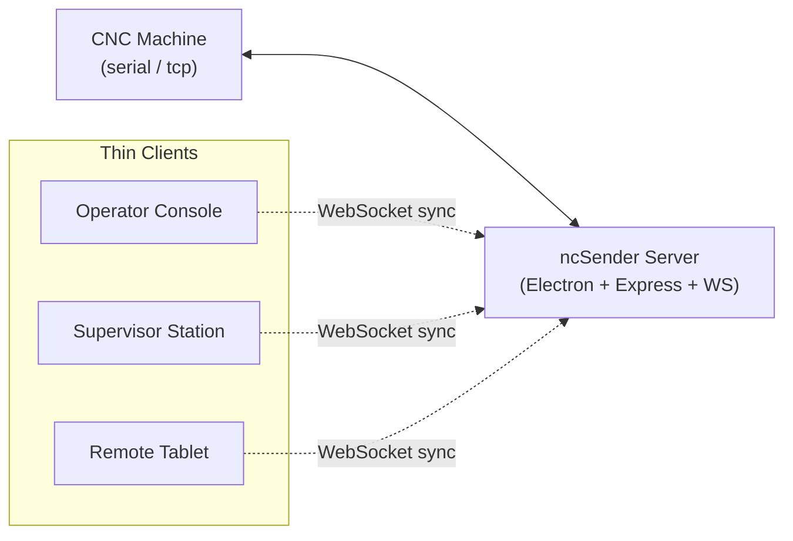
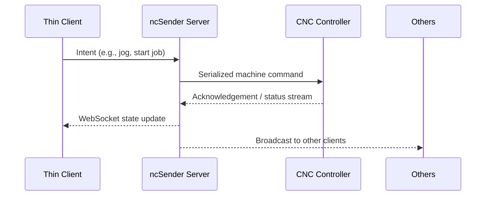

# ncSender Thin-Client Architecture

ncSender is deployed as a hub-and-spoke control system: a single server instance speaks directly to the CNC machine, while any number of thin clients connect over WebSockets to present synchronized UI front-ends. This document describes how the pieces fit together and what the runtime behaviors look like.

## Architectural Diagram

## Core Components
- **Server (Hub)** — Runs once per machine. Hosts the REST API and WebSocket gateway, manages CNC communication (serial/TCP), enforces machine safety, and persists settings/jobs on the controller host.
- **Thin Clients (Spokes)** — Electron windows or browser sessions that render the Vue UI. They hold ephemeral UI state, subscribe to server broadcasts, and send intent (commands, form submissions) back to the server through WebSockets or REST endpoints.
- **Machine Interface** — Serial or TCP link to the CNC controller (e.g., GrblHAL). The server owns this channel exclusively to guarantee deterministic command sequencing and feedback parsing.

## Data & Control Flow
1. Clients authenticate the session (implicit in Electron, explicit when hosted) and establish a WebSocket connection to the server.
2. Clients request the current machine/app state snapshot via REST (`/api/*`) and hydrate their local Vue stores.
3. UI interactions (jog, job start, firmware config) send intent messages over the WebSocket. The server validates commands, queues them, and forwards to the machine.
4. Machine responses and telemetry are streamed back to the server, parsed, and normalized into shared state.
5. The server pushes state deltas and event notifications to every connected client, keeping UIs in lockstep without them talking to each other directly.

## Synchronization Model
- The server is the source of truth for controller state, job progress, alarms, and configuration. Clients treat their local store as a cached view that is replaced whenever a broadcast arrives.
- WebSocket payloads are structured as specific event channels (e.g., `machine:status`, `jobs:progress`, `settings:update`) so that clients can update only the slices they render.
- Because clients never hold privileged write access, opening more UI sessions does not increase the risk of conflicting machine commands.

## Command Lifecycle

## Deployment Scenarios
- **Embedded (Electron):** The server boots inside the Electron main process. A single window ships with built-in credentials and a loopback WebSocket to the hub.
- **Headless Server:** The same server bundle runs without Electron, exposing HTTP(S) + WebSockets on a configurable port. Shop-floor terminals attach as thin clients via browser or packaged Electron builds.
- **Multi-Display Control:** Multiple clients can monitor or control the same machine simultaneously. Conflict resolution happens centrally because the server serializes command queues per machine.

## Reliability Considerations
- If a client disconnects, the machine keeps running; reconnecting yields the latest state snapshot and resubscribes to live events.
- If the server restarts, it reinitializes the machine link, reloads persisted settings, and waits for clients to reconnect. The machine interface is reopened only once to avoid bus contention.
- Latency-sensitive operations (jogging, feed hold) stay server-side, minimizing the effect of slow networks or thin clients.

## Extending the Architecture
- Add new UI panels by registering additional event channels on the server and wiring comet handlers in the Vue stores (`use-app-store.ts`).
- Introduce new device types by extending the controller abstraction in `app/electron/features/cnc/` while keeping the client protocol identical.
- Enhance monitoring by subscribing auxiliary clients (tablets, large displays) to the existing WebSocket stream without changing machine control logic.
