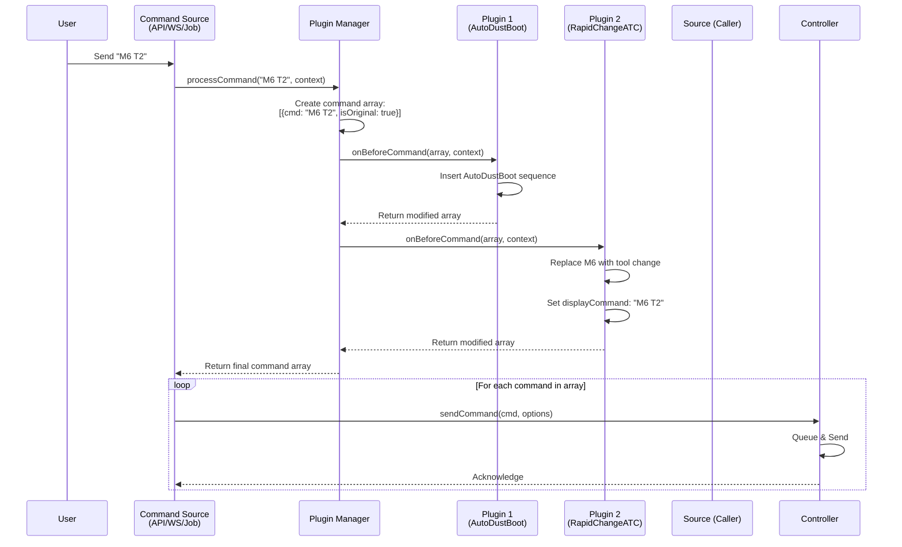

# ncSender Plugin Architecture

## Table of Contents
1. [Architecture Overview](#architecture-overview)
2. [Command Flow](#command-flow)
3. [Command Sources](#command-sources)
4. [Plugin Manager](#plugin-manager)
5. [Plugin API](#plugin-api)
6. [Controller](#controller)
7. [Implementation Examples](#implementation-examples)
8. [Migration Notes](#migration-notes)

---

## Architecture Overview

The plugin architecture follows a **unidirectional data flow** pattern with clear separation of concerns:

```
┌─────────────────────────────────────────────────────────────┐
│                      Command Sources                         │
│  ┌──────────────┐  ┌──────────────┐  ┌──────────────┐      │
│  │  API Routes  │  │  WebSocket   │  │ Job Manager  │      │
│  └──────┬───────┘  └──────┬───────┘  └──────┬───────┘      │
│         │                  │                  │              │
└─────────┼──────────────────┼──────────────────┼──────────────┘
          │                  │                  │
          └──────────────────┼──────────────────┘
                             ▼
                  ┌──────────────────────┐
                  │   Plugin Manager     │
                  │  ┌────────────────┐  │
                  │  │ AutoDustBoot   │  │
                  │  │ RapidChangeATC │  │
                  │  │     ...        │  │
                  │  └────────────────┘  │
                  └──────────┬───────────┘
                             │
                    Returns Command Array
                             │
          ┌──────────────────┴──────────────────┐
          │                                     │
          ▼                                     ▼
    ┌──────────┐                         ┌──────────┐
    │  Caller  │                         │  Caller  │
    │ Iterates │                         │ Iterates │
    └────┬─────┘                         └────┬─────┘
         │                                     │
         └──────────────────┬──────────────────┘
                            ▼
                  ┌──────────────────────┐
                  │     Controller       │
                  │  ┌────────────────┐  │
                  │  │ Queue          │  │
                  │  │ Send           │  │
                  │  │ Events         │  │
                  │  └────────────────┘  │
                  └──────────────────────┘
```

### Key Principles

1. **Single Responsibility**: Each component has one clear purpose
2. **No Circular Dependencies**: Plugin Manager doesn't know about Controller
3. **Unidirectional Flow**: Commands flow in one direction only
4. **Single Pass**: Plugins process commands exactly once
5. **Caller Control**: Caller orchestrates the flow between Plugin Manager and Controller

---

## Command Flow

### Flow Diagram



### Step-by-Step Flow

#### User sends "M6 T2"

1. **Command Source** receives user input
   - Input: `"M6 T2"`
   - Creates context: `{ sourceId: 'client', lineNumber: null, meta: {...} }`

2. **Plugin Manager** processes command
   - Input: `("M6 T2", context)`
   - Creates initial array: `[{ command: "M6 T2", isOriginal: true, displayCommand: null }]`

3. **AutoDustBoot Plugin** transforms array
   - Filters for `isOriginal` commands
   - Finds M6 command
   - Inserts sequence before original:
     ```javascript
     [
       { command: "(Start of AutoDustBoot Plugin Sequence)" },
       { command: "M8" },
       { command: "G4 P0.1" },
       { command: "M9" },
       { command: "(End of AutoDustBoot Plugin Sequence)" },
       { command: "M6 T2", isOriginal: true }
     ]
     ```

4. **RapidChangeATC Plugin** transforms array
   - Filters for `isOriginal` commands
   - Finds M6 command
   - Replaces with tool change sequence
   - Sets `displayCommand` based on `showMacroCommand` setting:
     ```javascript
     [
       { command: "(Start of AutoDustBoot Plugin Sequence)" },
       { command: "M8" },
       { command: "G4 P0.1" },
       { command: "M9" },
       { command: "(End of AutoDustBoot Plugin Sequence)" },
       {
         command: "G21\nM5\nG53 G0 Z0\n...",  // Full tool change sequence
         isOriginal: true,
         displayCommand: "M6 T2"  // Simplified display (if showMacroCommand: false)
       }
     ]
     ```

5. **Command Source** receives array and iterates
   - For each command in array:
     - Call `controller.sendCommand(cmd.command, { displayCommand: cmd.displayCommand })`

6. **Controller** processes each command
   - No plugin chain (already processed!)
   - `displayCommand = cmd.displayCommand || cmd.command`
   - Queue and send to CNC

---

## Command Sources

### 1. API Routes (`cnc/routes.js`)

**Endpoint**: `POST /api/cnc/send-command`

```javascript
router.post('/send-command', async (req, res) => {
  const { command, commandId, displayCommand, meta } = req.body;

  // Step 1: Process command through Plugin Manager
  const commandArray = await pluginManager.processCommand(command, {
    sourceId: 'client',
    commandId: commandId || `${Date.now()}`,
    meta: meta || {}
  });

  // Step 2: Iterate and send each command to Controller
  for (const cmd of commandArray) {
    await cncController.sendCommand(cmd.command, {
      commandId: cmd.commandId || `${Date.now()}`,
      displayCommand: cmd.displayCommand || cmd.command,
      meta: { ...cmd.meta, sourceId: 'client' }
    });
  }

  res.json({ success: true });
});
```

**Flow**:
```
User Terminal Input → POST /api/cnc/send-command → Plugin Manager → Controller
```

---

### 2. WebSocket (`server/websocket.js`)

**Handler**: `handleWebSocketCommand(ws, payload)`

```javascript
const handleWebSocketCommand = async (ws, payload) => {
  const { command, commandId, displayCommand, meta } = payload;

  // Step 1: Process command through Plugin Manager
  const commandArray = await pluginManager.processCommand(command, {
    sourceId: 'client',
    commandId: commandId || `${Date.now()}`,
    meta: meta || {}
  });

  // Step 2: Iterate and send each command to Controller
  for (const cmd of commandArray) {
    await cncController.sendCommand(cmd.command, {
      commandId: cmd.commandId || `${Date.now()}`,
      displayCommand: cmd.displayCommand || cmd.command,
      meta: { ...cmd.meta, sourceId: 'client' }
    });
  }
};
```

**Flow**:
```
Client WebSocket → ws.on('message') → handleWebSocketCommand → Plugin Manager → Controller
```

---

### 3. Job Manager (`gcode/job-manager.js`)

**Method**: Processing G-code file line by line

```javascript
class JobManager {
  async processGcodeLine(line, lineNumber) {
    // Step 1: Process line through Plugin Manager
    const commandArray = await pluginManager.processCommand(line, {
      sourceId: 'job',
      lineNumber: lineNumber,
      meta: { jobId: this.currentJobId }
    });

    // Step 2: Iterate and send each command to Controller
    for (const cmd of commandArray) {
      await cncController.sendCommand(cmd.command, {
        commandId: `job-${this.currentJobId}-${lineNumber}`,
        displayCommand: cmd.displayCommand || cmd.command,
        meta: { ...cmd.meta, sourceId: 'job', lineNumber }
      });
    }
  }
}
```

**Flow**:
```
G-code File → Job Manager Iterator → Plugin Manager → Controller
```

---

## Plugin Manager

### Responsibilities

1. **Orchestrate Plugins**: Iterate through registered plugins
2. **Transform Commands**: Convert single command into command array
3. **No Side Effects**: Pure transformation, no I/O operations
4. **No Controller Awareness**: Doesn't know Controller exists

### API

#### `processCommand(command, context)`

Processes a command through all registered plugins and returns a command array.

**Parameters**:
- `command` (string): The G-code command to process
- `context` (object): Context information
  - `sourceId` (string): Source of command (`'client'`, `'job'`, `'macro'`)
  - `commandId` (string): Optional command identifier
  - `lineNumber` (number): Optional line number (for job context)
  - `meta` (object): Optional metadata

**Returns**: `Array<CommandObject>`

**CommandObject Structure**:
```javascript
{
  command: string,           // The G-code command
  displayCommand: string?,   // Optional: what to show in terminal
  isOriginal: boolean,       // True if this is the original user command
  meta: object?,            // Optional: command metadata
  commandId: string?        // Optional: command identifier
}
```

**Example**:
```javascript
const commandArray = await pluginManager.processCommand('M6 T2', {
  sourceId: 'client',
  meta: {}
});

// Returns:
[
  { command: '(Start of AutoDustBoot Plugin Sequence)' },
  { command: 'M8' },
  { command: 'M9' },
  { command: '(End of AutoDustBoot Plugin Sequence)' },
  {
    command: 'G21\nM5\n...',  // Full tool change sequence
    isOriginal: true,
    displayCommand: 'M6 T2'   // Simplified display
  }
]
```

### Implementation

```javascript
// plugin-manager.js
class PluginManager {
  async processCommand(command, context = {}) {
    // Initialize command array with original command
    let commands = [{
      command: command,
      isOriginal: true,
      displayCommand: null,
      meta: context.meta || {},
      commandId: context.commandId || null
    }];

    // Iterate through all registered plugins
    for (const [pluginId, plugin] of this.plugins.entries()) {
      const pluginContext = this.pluginContexts.get(pluginId);

      if (plugin.module.onBeforeCommand) {
        try {
          const result = await plugin.module.onBeforeCommand(commands, context, pluginContext);
          // Plugin returns modified array or undefined (no changes)
          if (Array.isArray(result)) {
            commands = result;
          }
        } catch (error) {
          console.error(`Plugin ${pluginId} error:`, error);
          // Continue with other plugins even if one fails
        }
      }
    }

    return commands;
  }
}
```

---

## Plugin API

### Plugin Structure

```javascript
// plugin/index.js
export async function onLoad(ctx) {
  ctx.log('Plugin loaded');

  ctx.registerEventHandler('onBeforeCommand', async (commands, context) => {
    // Transform command array
    return modifiedCommands;
  });
}

export async function onUnload(ctx) {
  ctx.log('Plugin unloaded');
}
```

### Event Handler: `onBeforeCommand`

**Signature**: `async onBeforeCommand(commands, context, ctx)`

**Parameters**:
- `commands` (Array<CommandObject>): Array of command objects
- `context` (object): Request context
  - `sourceId` (string): Command source
  - `lineNumber` (number): Line number (for jobs)
  - `meta` (object): Metadata
- `ctx` (object): Plugin context
  - `log()`: Logging function
  - `getSettings()`: Get plugin settings
  - `getMachineState()`: Get current machine state

**Returns**: `Array<CommandObject>` or `undefined`
- Return modified array to apply changes
- Return `undefined` to leave array unchanged

### Helper Functions

Plugins should use helper functions to filter commands:

```javascript
// Filter for original commands only
const filterOriginal = (commands) => {
  return commands.filter(cmd => cmd.isOriginal);
};

// Find original command matching pattern
const findOriginal = (commands, pattern) => {
  return commands.find(cmd => cmd.isOriginal && pattern.test(cmd.command));
};
```

---

## Controller

### Responsibilities

1. **Execute Commands**: Queue and send commands to CNC
2. **Event Broadcasting**: Emit command lifecycle events
3. **No Plugin Processing**: Receives already-processed commands

### Changes from Old Architecture

**REMOVED**:
- ❌ Plugin chain in `sendCommand()`
- ❌ `pluginEventBus.emitChain('onBeforeCommand')`
- ❌ `processedByPlugins` meta tracking

**KEPT**:
- ✅ Command queuing
- ✅ Event broadcasting
- ✅ Display command handling
- ✅ Real-time command handling

### API

#### `sendCommand(command, options)`

Queues and sends a command to the CNC (no plugin processing).

**Parameters**:
- `command` (string): The G-code command
- `options` (object):
  - `displayCommand` (string): Optional display override
  - `commandId` (string): Optional command ID
  - `meta` (object): Optional metadata

**Behavior**:
```javascript
async sendCommand(command, options = {}) {
  const { displayCommand, commandId, meta } = options;

  // No plugin chain - command is already processed!

  const display = displayCommand || command;

  // Queue command
  // Send to CNC
  // Broadcast events
}
```

---

## Implementation Examples

### Example 1: AutoDustBoot Plugin

**Purpose**: Inject M8/M9 sequence before M6 tool changes

```javascript
// autodustboot/index.js
export async function onLoad(ctx) {
  ctx.registerEventHandler('onBeforeCommand', async (commands, context) => {
    const settings = ctx.getSettings();
    const expandCommand = settings.expandCommand || 'M8';
    const retractCommand = settings.retractCommand || 'M9';

    // Find original M6 command
    const m6Index = commands.findIndex(cmd =>
      cmd.isOriginal && /M6(?!\d)/i.test(cmd.command)
    );

    if (m6Index === -1) {
      return commands; // No M6 found
    }

    // Insert AutoDustBoot sequence before M6
    const sequence = [
      { command: '(Start of AutoDustBoot Plugin Sequence)' },
      { command: expandCommand },
      { command: 'G4 P0.1' },
      { command: retractCommand },
      { command: '(End of AutoDustBoot Plugin Sequence)' }
    ];

    commands.splice(m6Index, 0, ...sequence);

    return commands;
  });
}
```

**Input**:
```javascript
[{ command: 'M6 T2', isOriginal: true }]
```

**Output**:
```javascript
[
  { command: '(Start of AutoDustBoot Plugin Sequence)' },
  { command: 'M8' },
  { command: 'G4 P0.1' },
  { command: 'M9' },
  { command: '(End of AutoDustBoot Plugin Sequence)' },
  { command: 'M6 T2', isOriginal: true }
]
```

---

### Example 2: RapidChangeATC Plugin

**Purpose**: Replace M6 with full tool change sequence, control display

```javascript
// rapidchangeatc/index.js
export async function onLoad(ctx) {
  ctx.registerEventHandler('onBeforeCommand', async (commands, context) => {
    const settings = ctx.getSettings();
    const machineState = ctx.getMachineState();

    // Find original M6 command
    const m6Cmd = commands.find(cmd =>
      cmd.isOriginal && /M6(?!\d)/i.test(cmd.command)
    );

    if (!m6Cmd) {
      return commands; // No M6 found
    }

    // Extract tool number
    const toolMatch = m6Cmd.command.match(/T(\d+)/i);
    if (!toolMatch) {
      return commands; // Invalid M6
    }

    const toolNumber = parseInt(toolMatch[1], 10);

    // Generate tool change program
    const toolChangeProgram = generateToolChangeProgram(toolNumber, settings, machineState);

    // Replace M6 with tool change sequence
    m6Cmd.command = toolChangeProgram.join('\n');

    // Set display based on showMacroCommand setting
    const showMacro = settings.showMacroCommand || false;
    m6Cmd.displayCommand = showMacro
      ? m6Cmd.command  // Show full sequence
      : `M6 T${toolNumber}`;  // Show simplified

    return commands;
  });
}

function generateToolChangeProgram(toolNumber, settings, machineState) {
  // Calculate positions, generate G-code sequence
  return [
    '(Start of RapidChangeATC Plugin Sequence)',
    '#<wasMetric> = #<_metric>',
    'G21',
    'M5',
    'G53 G0 Z0',
    // ... full tool change sequence
    '(End of RapidChangeATC Plugin Sequence)'
  ];
}
```

**Input** (after AutoDustBoot):
```javascript
[
  { command: '(Start of AutoDustBoot Plugin Sequence)' },
  { command: 'M8' },
  { command: 'M9' },
  { command: '(End of AutoDustBoot Plugin Sequence)' },
  { command: 'M6 T2', isOriginal: true }
]
```

**Output** (showMacroCommand: false):
```javascript
[
  { command: '(Start of AutoDustBoot Plugin Sequence)' },
  { command: 'M8' },
  { command: 'M9' },
  { command: '(End of AutoDustBoot Plugin Sequence)' },
  {
    command: '(Start of RapidChangeATC...)\nG21\nM5\n...',
    isOriginal: true,
    displayCommand: 'M6 T2'  // Terminal shows this
  }
]
```

---

## Migration Notes

### Key Changes from Old Architecture

#### Before (Old Architecture)

```javascript
// Plugin calls ctx.sendGcode() recursively
ctx.registerEventHandler('onBeforeCommand', async (line, context) => {
  if (detectM6(line)) {
    await ctx.sendGcode(sequence, { meta: markAsProcessed() });
    return line;  // Returns original
  }
  return line;
});

// Problem: Recursive plugin chain, double processing
```

#### After (New Architecture)

```javascript
// Plugin transforms command array
ctx.registerEventHandler('onBeforeCommand', async (commands, context) => {
  const m6Cmd = commands.find(cmd => cmd.isOriginal && detectM6(cmd.command));
  if (m6Cmd) {
    // Insert or replace commands
    commands.splice(index, 0, ...sequence);
  }
  return commands;
});

// Solution: Single pass, no recursion
```

### Breaking Changes

1. **Plugin Event Handler Signature**
   - Old: `onBeforeCommand(line, context)`
   - New: `onBeforeCommand(commands, context, ctx)`

2. **No More `ctx.sendGcode()`**
   - Plugins no longer call controller
   - Plugins only transform arrays

3. **No More `markAsProcessed()`**
   - No need for tracking
   - Plugins run exactly once

4. **Controller Changes**
   - `sendCommand()` no longer calls plugin chain
   - Commands arrive already processed

### Migration Checklist

- [ ] Update Plugin Manager with `processCommand()` method
- [ ] Update AutoDustBoot plugin to use new API
- [ ] Update RapidChangeATC plugin to use new API
- [ ] Update API routes to call Plugin Manager
- [ ] Update WebSocket handler to call Plugin Manager
- [ ] Update Job Manager to call Plugin Manager
- [ ] Remove plugin chain from Controller
- [ ] Remove `ctx.sendGcode()` from plugin context
- [ ] Remove `processedByPlugins` tracking
- [ ] Test all command sources
- [ ] Test plugin combinations

---

## Benefits of New Architecture

### 1. **No Recursive Processing**
- Plugins run exactly once
- No risk of infinite loops
- No double processing bugs

### 2. **Clear Data Flow**
- Unidirectional: Source → Plugin Manager → Controller
- No circular dependencies
- Easy to trace and debug

### 3. **Separation of Concerns**
- Plugin Manager: Transform commands
- Controller: Execute commands
- Caller: Orchestrate flow

### 4. **Better Testability**
- Plugin Manager can be tested in isolation
- Plugins can be tested with mock arrays
- Controller can be tested without plugins

### 5. **Extensibility**
- Easy to add plugin priorities
- Easy to add conditional plugin execution
- Easy to add plugin dependencies

### 6. **Performance**
- Single iteration through plugins
- No redundant processing
- Fewer function calls

---

## Future Enhancements

### Plugin Priorities
```javascript
// plugin manifest.json
{
  "id": "com.ncsender.autodustboot",
  "priority": 100  // Higher runs first
}
```

### Conditional Plugin Execution
```javascript
// Only run for specific sources
ctx.registerEventHandler('onBeforeCommand', async (commands, context) => {
  if (context.sourceId !== 'job') return commands;
  // ...
});
```

### Plugin Dependencies
```javascript
// plugin manifest.json
{
  "id": "com.ncsender.rapidchangeatc",
  "dependencies": ["com.ncsender.autodustboot"]
}
```

---

## Appendix: Complete Flow Example

### User sends "M6 T2" via Terminal

```
┌─────────────────────────────────────────────────────────────┐
│ Step 1: User Input                                          │
│ User types "M6 T2" in terminal                              │
└───────────────────────────┬─────────────────────────────────┘
                            │
┌───────────────────────────▼─────────────────────────────────┐
│ Step 2: API Route Handler                                   │
│ POST /api/cnc/send-command                                  │
│ Receives: { command: "M6 T2" }                              │
└───────────────────────────┬─────────────────────────────────┘
                            │
┌───────────────────────────▼─────────────────────────────────┐
│ Step 3: Call Plugin Manager                                 │
│ pluginManager.processCommand("M6 T2", {                     │
│   sourceId: 'client',                                       │
│   meta: {}                                                  │
│ })                                                          │
└───────────────────────────┬─────────────────────────────────┘
                            │
┌───────────────────────────▼─────────────────────────────────┐
│ Step 4: Plugin Manager Creates Initial Array                │
│ [{ command: "M6 T2", isOriginal: true, displayCommand: null }] │
└───────────────────────────┬─────────────────────────────────┘
                            │
┌───────────────────────────▼─────────────────────────────────┐
│ Step 5: AutoDustBoot Plugin Processes                       │
│ Finds M6, inserts sequence before:                          │
│ [                                                           │
│   { command: "(Start...)" },                                │
│   { command: "M8" },                                        │
│   { command: "M9" },                                        │
│   { command: "(End...)" },                                  │
│   { command: "M6 T2", isOriginal: true }                    │
│ ]                                                           │
└───────────────────────────┬─────────────────────────────────┘
                            │
┌───────────────────────────▼─────────────────────────────────┐
│ Step 6: RapidChangeATC Plugin Processes                     │
│ Finds M6, replaces with tool change program:                │
│ [                                                           │
│   { command: "(Start...)" },                                │
│   { command: "M8" },                                        │
│   { command: "M9" },                                        │
│   { command: "(End...)" },                                  │
│   { command: "G21\nM5\n...",                                │
│     isOriginal: true,                                       │
│     displayCommand: "M6 T2" }                               │
│ ]                                                           │
└───────────────────────────┬─────────────────────────────────┘
                            │
┌───────────────────────────▼─────────────────────────────────┐
│ Step 7: API Route Receives Array & Iterates                 │
│ for (const cmd of commandArray) {                           │
│   await controller.sendCommand(cmd.command, {               │
│     displayCommand: cmd.displayCommand                      │
│   });                                                       │
│ }                                                           │
└───────────────────────────┬─────────────────────────────────┘
                            │
┌───────────────────────────▼─────────────────────────────────┐
│ Step 8: Controller Processes Each Command                   │
│ 1. Queue & send "(Start...)"                                │
│ 2. Queue & send "M8"                                        │
│ 3. Queue & send "M9"                                        │
│ 4. Queue & send "(End...)"                                  │
│ 5. Queue & send "G21\nM5\n..." (displays as "M6 T2")        │
└───────────────────────────┬─────────────────────────────────┘
                            │
┌───────────────────────────▼─────────────────────────────────┐
│ Step 9: Terminal Display                                    │
│ > (Start of AutoDustBoot Plugin Sequence)                   │
│ > M8                                                        │
│ > M9                                                        │
│ > (End of AutoDustBoot Plugin Sequence)                     │
│ > M6 T2                    ← Simplified display             │
│                                                             │
│ Machine executes full tool change sequence behind the scenes│
└─────────────────────────────────────────────────────────────┘
```

