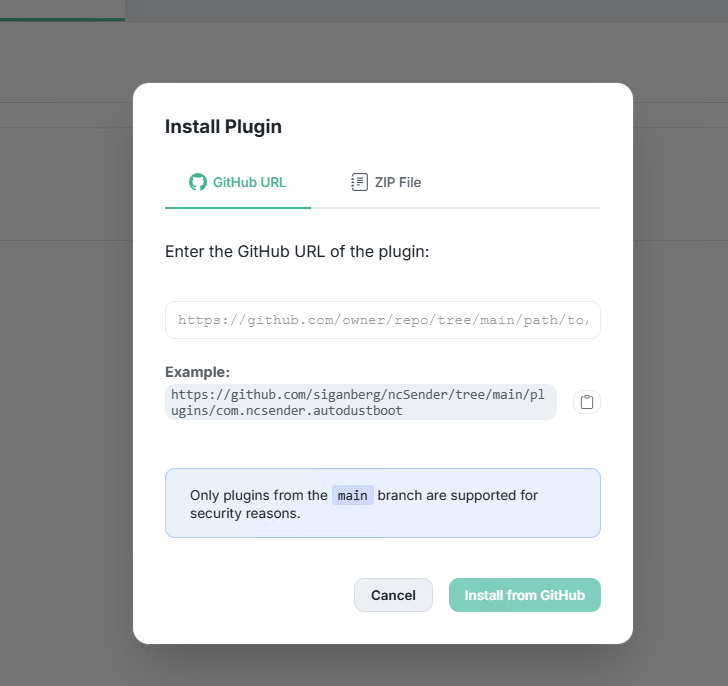

# ncSender Plugins

This directory contains the official plugins that ship with ncSender.

## Installing These Plugins

1. Browse to the plugin’s folder here on GitHub (for example, `com.ncsender.autodustboot`) and copy its URL.
   It should look like `https://github.com/siganberg/ncSender/tree/main/plugins/<plugin-id>`.
2. In ncSender, open the **Settings** dialog and switch to the **Plugins** tab.
3. Click **+ Install Plugin**, paste the URL, and confirm.

   

4. The plugin installs right away—no restart needed.

For the latest development and contribution guidance, please see the wiki:
https://github.com/siganberg/ncSender/wiki/Plugin-Development-Guide
